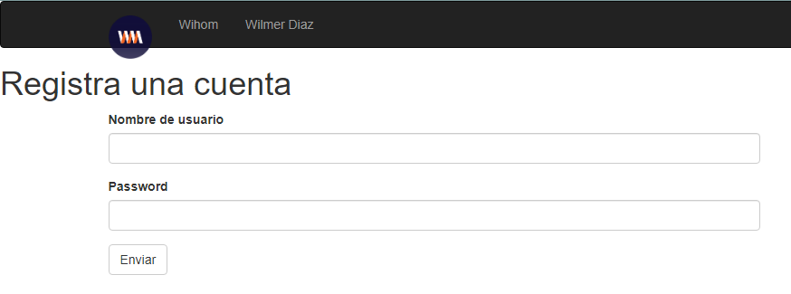

# TodoList App 

Aplicación que permite el registro e ingreso de usuarios cuyo objetivo sea tener un control de las tareas personales y/o laborales.

Está desarrollada temporalmente en Flask, usando extensiones para el uso de Bootstrap e integración con GCP. 

Se encuentra [aquí](https://nimble-orbit-244019.ue.r.appspot.com/auth/signup)

